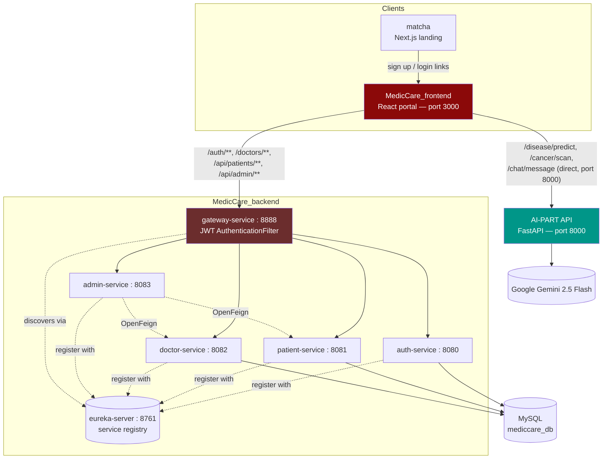
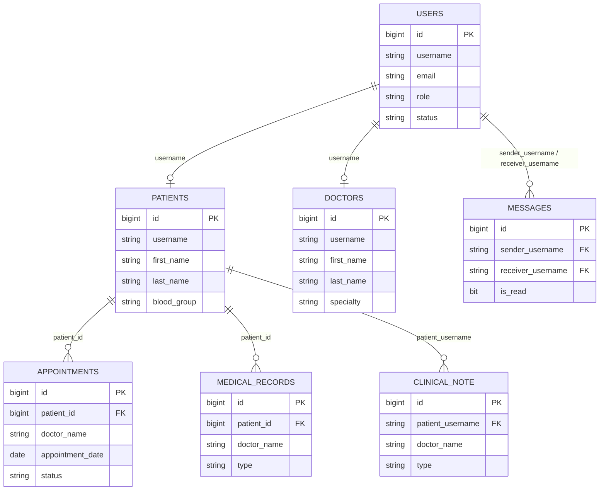

<div align="center">


# Medical Diagnostic System (MedCare)

### A microservices health platform: patient/doctor/admin portal, a Java service mesh, an AI engine for disease and cancer prediction, and a public marketing site.

[](MedicCare_backend/pom.xml)
[](MedicCare_backend)
[](MedicCare_frontend)
[](matcha)
[](AI-PART-DISEASE%20STUDY/api)
[](AI-PART-DISEASE%20STUDY/DEEP%20LEARNING)
[](mediccare_db.sql)
[](AI-PART-DISEASE%20STUDY/api/routers/chat.py)

[](https://github.com/flash-hero/Medical-Diagnostic-System/commits/main)
[](https://github.com/flash-hero/Medical-Diagnostic-System)
[](https://github.com/flash-hero/Medical-Diagnostic-System/stargazers)

</div>

<p align="center">
  
</p>

---

## Table of Contents

- [Overview](#overview)
- [System Map](#system-map)
- [Architecture](#architecture)
- [Services](#services)
- [Database Schema](#database-schema)
- [AI Engine](#ai-engine)
- [Tech Stack](#tech-stack)
- [Project Structure](#project-structure)
- [Getting Started](#getting-started)
- [API Reference](#api-reference)
- [Roadmap](#roadmap)
- [License](#license)

---

## Overview

MedCare is four projects working together behind one product:

| Piece | What it is |
|---|---|
| `matcha/` | Public marketing site — Next.js, scroll-driven animation, links out to sign-up and login |
| `MedicCare_frontend/` | The actual product — a React portal with separate views for patients, doctors, and admins |
| `MedicCare_backend/` | Six Spring Boot microservices behind a Eureka registry and an API Gateway |
| `AI-PART-DISEASE STUDY/` | A Python FastAPI service wrapping a disease-prediction model, a lung-cancer CNN, and a Gemini-powered chatbot |

`mediccare_db.sql` holds the shared MySQL schema, and `start-app.ps1` boots all seven runtime pieces (Eureka, three services, the gateway, the AI API, and the frontend) in the right order with health checks between each step.

---

## System Map

<table>
<tr>
<td width="50%" valign="top">


**Find and book a doctor**
The landing page visualizes the doctor directory as a connected graph by specialty before the user ever logs in.

</td>
<td width="50%" valign="top">


**Predictive pathway**
A second scroll section previews the deep-learning lung-scan feature — this is the same CNN behind `/cancer/scan`.

</td>
</tr>
<tr>
<td width="50%" valign="top">


**Patient dashboard**
Appointment count, a rolling health score, and quick actions into the AI Health Assistant, booking, and history.

</td>
<td width="50%" valign="top">


**Disease Prediction Form**
Vitals plus a symptom checklist, submitted straight to the FastAPI `/disease/predict` endpoint.

</td>
</tr>
</table>

<p align="center">
  
</p>

<p align="center">The model returns a label, a confidence score, and plain-language recommendations, with a one-click handoff into the Gemini chatbot for follow-up questions.</p>

---

## Architecture



<p align="center">
  
</p>

<p align="center">The registry above is the system actually running — five services UP, each self-registered on startup.</p>

The gateway already has a route reserved for `/api/ai/**` pointing at an `AI-SERVICE` discovered through Eureka, but the Python API doesn't register itself yet — today the frontend calls port 8000 directly, bypassing the gateway and its JWT filter for AI requests. See [Roadmap](#roadmap).

---

## Services

| Service | Port | Responsibility | Notable endpoints |
|---|---|---|---|
| `eureka-server` | 8761 | Service registry and discovery | Dashboard at `/` |
| `gateway-service` | 8888 | Single entry point, JWT validation, path-based routing | Routes `/auth/**`, `/doctors/**`, `/api/patients/**`, `/api/appointments/**`, `/api/messages/**`, `/api/admin/**` |
| `auth-service` | 8080 | Registration, login, JWT issuing, account moderation | `/auth/register`, `/auth/login`, `/auth/users/{id}/suspend`, `/auth/users/{id}/approve` |
| `patient-service` | 8081 | Patient profile, appointments, messaging, dashboard stats | `/api/patients/dashboard-stats`, `/api/appointments/book`, `/api/messages/send` |
| `doctor-service` | 8082 | Doctor directory and appointment handling | `/doctors/all`, `/doctors/appointments/{doctorName}` |
| `admin-service` | 8083 | Platform-wide statistics, aggregated via Feign from patient/doctor services | `/api/admin/stats` |
| AI API (`AI-PART-DISEASE STUDY/api`) | 8000 | Disease prediction, cancer detection, medical chatbot | `/disease/predict`, `/cancer/scan`, `/chat/message` |
| `MedicCare_frontend` | 3000 | Patient, doctor, and admin web portal | — |
| `matcha` | dev: 3000 (separate project) | Public marketing / landing site | — |

---

## Database Schema



There are no database-level foreign keys — each microservice owns its own tables and rows are joined at the application layer by `username` or `patient_id`, which is the expected pattern once a schema is split across services even while it still lives in one physical database.

---

## AI Engine

**Disease prediction** — a Random Forest classifier (`class_weight='balanced'`) trained on vitals and symptoms, reaching 97.8% overall accuracy:

| Disease | Precision | Recall | F1 |
|---|---|---|---|
| Common Cold | 1.00 | 1.00 | 1.00 |
| Healthy | 1.00 | 1.00 | 1.00 |
| Hypertension | 0.99 | 1.00 | 0.99 |
| Influenza | 0.94 | 0.93 | 0.94 |
| Covid-19 | 0.93 | 0.94 | 0.93 |

The only real confusion is between Influenza and Covid-19, which share fever and fatigue as symptoms. Body temperature and blood pressure are the strongest predictors overall.

**Cancer detection** — a MobileNetV2 transfer-learning CNN (frozen ImageNet base, custom classification head) trained on 224x224 lung scan images, served through `/cancer/scan`. The router loads the model lazily and returns a 503 with a clear message rather than crashing if the trained `.h5` file hasn't been added yet — a deliberate, sensible way to ship the API ahead of a large model artifact.

**Medical chatbot** — Gemini 2.5 Flash, prompted as "MedCare AI," optionally given the disease-prediction result as context so follow-up questions are diagnosis-aware. The system prompt explicitly instructs it to avoid definitive diagnoses and to recommend seeing a real doctor.

---

## Tech Stack

| Layer | Stack |
|---|---|
| **Backend microservices** | Java 17, Spring Boot 3.4, Spring Cloud Gateway, Spring Cloud Netflix Eureka, Spring Security, JJWT, Spring Data JPA, OpenFeign |
| **Database** | MySQL |
| **AI engine** | FastAPI, scikit-learn (Random Forest), TensorFlow / Keras (MobileNetV2), Google Generative AI (Gemini 2.5 Flash), Pillow |
| **Patient/Doctor/Admin portal** | React 18, React Router, Tailwind CSS, Framer Motion, Recharts, Axios, React Hot Toast |
| **Marketing site** | Next.js 14, TypeScript, Tailwind CSS, Framer Motion |
| **Shared palette** | Deep clinical red (`#8B0909`) on warm cream (`#EDD9CC`), consistent across both frontends |

---

## Project Structure

```
Medical-Diagnostic-System/
├── AI-PART-DISEASE STUDY/
│   ├── api/
│   │   ├── main.py                    # FastAPI app, mounts the three routers below
│   │   └── routers/
│   │       ├── disease.py             # /disease/predict — Random Forest
│   │       ├── cancer.py              # /cancer/scan — MobileNetV2 CNN
│   │       └── chat.py                # /chat/message — Gemini 2.5 Flash
│   ├── MACHINE LEARNING/              # Notebooks, model_report.md, visualization_report.md
│   └── DEEP LEARNING/
│       ├── train_cnn.py               # MobileNetV2 transfer-learning training script
│       └── Model/                     # class_indices.pkl (+ lung_cancer_model.h5 once trained)
├── MedicCare_backend/
│   ├── eureka-server/
│   ├── gateway-service/
│   ├── auth-service/
│   ├── patient-service/
│   ├── doctor-service/
│   ├── admin-service/
│   └── pom.xml                        # Parent POM, Spring Boot 3.4.2, Java 17
├── MedicCare_frontend/
│   └── src/
│       ├── pages/ (Auth, Patient, Doctor, Admin, Landing)
│       ├── components/ (Patient, Doctor, Admin, Landing)
│       ├── services/                  # Axios API clients
│       └── context/
├── matcha/
│   ├── app/page.tsx                   # All landing-page copy and links live here
│   └── components/
├── mediccare_db.sql                   # users, patients, doctors, appointments,
│                                       # medical_records, clinical_note, messages
└── start-app.ps1                      # Boots Eureka → Auth/Doctor/Patient → Gateway → AI API → Frontend
```

---

## Getting Started

### Prerequisites

- Java 17 and Maven
- MySQL
- Python 3.11
- Node.js

### 1. Database

```bash
mysql -u root -p < mediccare_db.sql
```

### 2. Backend microservices

```bash
cd MedicCare_backend
mvn spring-boot:run -pl eureka-server
# in separate terminals, once Eureka is up:
mvn spring-boot:run -pl auth-service
mvn spring-boot:run -pl doctor-service
mvn spring-boot:run -pl patient-service
mvn spring-boot:run -pl admin-service
# start the gateway last, once the above are registered:
mvn spring-boot:run -pl gateway-service
```

Eureka's dashboard is at `http://localhost:8761`.

### 3. AI API

```bash
cd "AI-PART-DISEASE STUDY/api"
pip install -r requirements.txt
echo "GEMINI_API_KEY=your-key-here" > .env
python main.py
```

Interactive docs at `http://localhost:8000/docs`. Disease prediction works immediately; cancer detection returns a 503 until `lung_cancer_model.h5` is placed in `DEEP LEARNING/Model/` (see `train_cnn.py`).

### 4. Frontend

```bash
cd MedicCare_frontend
npm install
npm start
```

Opens at `http://localhost:3000`.

### 5. Landing page (optional, separate project)

```bash
cd matcha
npm install
npm run dev
```

### Or start everything at once

```powershell
.\start-app.ps1
```

Boots all seven pieces above in the correct order with health checks between each. The script currently has the repository path hardcoded (`C:\Users\mehdi\Desktop\medicCare\...`) — update those paths to match your local clone before running it, and note it does not start `admin-service` or `matcha`.

---

## API Reference

**auth-service** (`/auth`)

| Method | Endpoint | Purpose |
|---|---|---|
| `POST` | `/register` | Create an account |
| `POST` | `/login` | Authenticate, receive a JWT |
| `GET` / `PUT` | `/profile` | View or edit the logged-in user's profile |
| `GET` | `/users` | List users (admin) |
| `PUT` | `/users/{id}/suspend`, `/unsuspend`, `/approve` | Account moderation (admin) |

**patient-service** (`/api/patients`, `/api/appointments`, `/api/messages`)

| Method | Endpoint | Purpose |
|---|---|---|
| `GET` | `/api/patients/dashboard-stats` | Dashboard counters |
| `POST` | `/api/appointments/book` | Book an appointment |
| `GET` | `/api/appointments/my` | The current patient's appointments |
| `PUT` | `/api/appointments/{id}/cancel` | Cancel an appointment |
| `POST` | `/api/messages/send` | Send a message |
| `GET` | `/api/messages/conversations` | List conversations |

**doctor-service** (`/doctors`)

| Method | Endpoint | Purpose |
|---|---|---|
| `GET` | `/all`, `/active` | List doctors |
| `GET` | `/appointments/{doctorName}` | A doctor's appointment list |
| `PUT` | `/appointments/{id}/status` | Update appointment status |

**admin-service** (`/api/admin`)

| Method | Endpoint | Purpose |
|---|---|---|
| `GET` | `/stats` | Platform-wide statistics, pulled via OpenFeign from patient- and doctor-service |

**AI API** (direct on port 8000, not yet behind the gateway)

| Method | Endpoint | Purpose |
|---|---|---|
| `POST` | `/disease/predict` | Vitals + symptoms in, disease label + confidence out |
| `POST` | `/cancer/scan` | Lung scan image in, malignancy label + confidence out |
| `POST` | `/chat/message` | Gemini-powered chat, optionally diagnosis-aware via a `context` field |

---

## Roadmap

- Register the AI API with Eureka as `AI-SERVICE` so the gateway route already configured for `/api/ai/**` actually works, and AI traffic gets the same JWT filter as everything else
- Reconcile the two landing experiences — `matcha/` (standalone Next.js) and `MedicCare_frontend/src/pages/Landing` (built into the React app) currently exist side by side
- Fix the absolute local image paths (`c:/Users/oussa/...`) in `model_report.md` and `visualization_report.md` so the figures render on GitHub
- Add an `.env.example` next to the AI API's `requirements.txt` documenting `GEMINI_API_KEY`
- Parametrize `start-app.ps1`'s hardcoded project path, and add `admin-service` and `matcha` to its startup sequence
- Add a Docker Compose file — seven services started by hand across seven terminals is the main friction point in local setup today

---

## License

No license file yet — this repository is currently all-rights-reserved by default. Consider adding an [MIT license](https://choosealicense.com/licenses/mit/) if you want others to freely use or fork it.

---

<div align="center">

Built by <a href="https://github.com/flash-hero">Oussama Tabakh</a>

</div>
